# Kế Hoạch Nâng Cấp Engine Tử Vi Đẩu Số — Chuẩn Nam Phái (Tam Hợp)

> **Phiên bản**: v2 (refined sau nghiên cứu chi tiết 12 hạng mục)

## Tổng Quan

Sau khi index toàn bộ codebase (772 nodes, 1734 edges), đọc chi tiết 9 engine files, và đối chiếu với nguồn chuyên ngành (lasotuvi.com, tuvisomenh.com, cohoc.net, aituvi.com, tuviglobal.com, tracuulasotuvi.com), dưới đây là kế hoạch nâng cấp đã refined.

---

## Đánh Giá Hiện Trạng Chi Tiết

### ✅ Đã đúng & đầy đủ

| Hạng mục | File | Ghi chú |
|---|---|---|
| 14 Chính Tinh + Bảng Độ Sáng | [ZiweiEngine.ts](file:///d:/tuviai/src/core/astrology/ZiweiEngine.ts) | Khớp chuẩn Học viện Lý số HN |
| Bảng Tứ Hóa (10 Can) | [SihuaEngine.ts](file:///d:/tuviai/src/core/astrology/SihuaEngine.ts) | Chuẩn Nam Phái Tam Hợp |
| Cung Mệnh / Cung Thân | [PalaceCalculator.ts](file:///d:/tuviai/src/core/astrology/PalaceCalculator.ts) | Công thức verified |
| Nạp Âm Cục (60 bộ) + Bản Mệnh | [AdvancedCalculator.ts](file:///d:/tuviai/src/core/astrology/AdvancedCalculator.ts) | Đầy đủ 60 Giáp Tý |
| Lục Cát Tinh (Lộc Tồn + 6 sao) | [AuxStarEngine.ts](file:///d:/tuviai/src/core/astrology/AuxStarEngine.ts) | Bảng Thiên Khôi/Việt đúng chuẩn lasotuvi |
| Lục Sát Tinh (6 sao) | [AuxStarEngine.ts](file:///d:/tuviai/src/core/astrology/AuxStarEngine.ts) | Hỏa/Linh luôn thuận ✅, Địa Không/Kiếp ✅ |
| Vòng Thái Tuế (12 sao) | [MinorStarEngine.ts](file:///d:/tuviai/src/core/astrology/MinorStarEngine.ts#L75-L84) | Đúng thứ tự + hướng |
| Vòng Bác Sĩ (12 sao) | [MinorStarEngine.ts](file:///d:/tuviai/src/core/astrology/MinorStarEngine.ts#L90-L104) | Khởi Lộc Tồn, chiều Âm Dương ✅ |
| Vòng Trường Sinh (12 sao) | [MinorStarEngine.ts](file:///d:/tuviai/src/core/astrology/MinorStarEngine.ts#L110-L134) | Khởi điểm + chiều ✅ |
| Sao cố định (4 sao) | [AuxStarEngine.ts](file:///d:/tuviai/src/core/astrology/AuxStarEngine.ts#L263-L285) | La, Võng, Thương, Sứ ✅ |
| Tuần/Triệt Không | [AuxStarEngine.ts](file:///d:/tuviai/src/core/astrology/AuxStarEngine.ts#L294-L313) | Cả hai đúng |
| Đại Hạn | [AdvancedCalculator.ts](file:///d:/tuviai/src/core/astrology/AdvancedCalculator.ts#L230-L246) | Công thức + chiều ✅ |
| Tiểu Vận | [AnnualEngine.ts](file:///d:/tuviai/src/core/astrology/AnnualEngine.ts#L92-L102) | Nam thuận / Nữ nghịch ✅ |
| Mệnh Chủ / Thân Chủ | [AdvancedCalculator.ts](file:///d:/tuviai/src/core/astrology/AdvancedCalculator.ts#L247-L261) | Đúng bảng chuẩn |
| Ngũ Hành 100+ sao | [NguHanhEngine.ts](file:///d:/tuviai/src/core/astrology/NguHanhEngine.ts) | Rất đầy đủ |
| Thiên Đức / Nguyệt Đức | [MinorStarEngine.ts](file:///d:/tuviai/src/core/astrology/MinorStarEngine.ts#L229-L230) | `9+yearChi` / `5+yearChi` ✅ |
| Thai Phụ / Phong Cáo | [MinorStarEngine.ts](file:///d:/tuviai/src/core/astrology/MinorStarEngine.ts#L169-L171) | `VănKhúc±2` = `Ngọ+h` / `Dần+h` ✅ |
| Tam Thai / Bát Tọa | [MinorStarEngine.ts](file:///d:/tuviai/src/core/astrology/MinorStarEngine.ts#L156-L160) | Dựa trên TảPhù/HữuBật ✅ |
| Ân Quang / Thiên Quý | [MinorStarEngine.ts](file:///d:/tuviai/src/core/astrology/MinorStarEngine.ts#L161-L166) | VănXương+day / VănKhúc-day ✅ |
| Long Trì / Phượng Các / Giải Thần | [MinorStarEngine.ts](file:///d:/tuviai/src/core/astrology/MinorStarEngine.ts#L203-L209) | Giải Thần đồng cung Phượng Các ✅ |
| Thiên Tài / Thiên Thọ | [MinorStarEngine.ts](file:///d:/tuviai/src/core/astrology/MinorStarEngine.ts#L263-L270) | Mệnh+yearChi / Thân+yearChi ✅ |
| Quốc Ấn / Đường Phù | [MinorStarEngine.ts](file:///d:/tuviai/src/core/astrology/MinorStarEngine.ts#L232-L236) | Từ Lộc Tồn ✅ |
| Thiên Trù | [MinorStarEngine.ts](file:///d:/tuviai/src/core/astrology/MinorStarEngine.ts#L222-L223) | `[5,6,0,5,6,8,2,6,9,10]` ✅ verified |
| Đào Hoa / Hồng Loan / Thiên Hỷ | [MinorStarEngine.ts](file:///d:/tuviai/src/core/astrology/MinorStarEngine.ts#L175-L181) | Các công thức đúng |
| Cô Thần / Quả Tú / Kiếp Sát | [MinorStarEngine.ts](file:///d:/tuviai/src/core/astrology/MinorStarEngine.ts#L183-L196) | Các bảng đúng |
| Hoa Cái / Phá Toái | [MinorStarEngine.ts](file:///d:/tuviai/src/core/astrology/MinorStarEngine.ts#L192-L196) | Đúng |
| Thiên Khốc / Thiên Hư / Thiên Mã | [MinorStarEngine.ts](file:///d:/tuviai/src/core/astrology/MinorStarEngine.ts#L198-L226) | Đúng |

### ⚠️ Cần verify (có thể sai)

| Hạng mục | Vấn đề | Chi tiết |
|---|---|---|
| **Thiên Quan / Thiên Phúc** | Sai lệch ở Can **Ất** | Codebase: Ất→Thìn(4)/Thân(8). Nhiều nguồn web: Ất→Mùi(7)/Dậu(9). Cần verify lasotuvi.com |
| **Lưu Hà** | Sai lệch ở Can **Đinh** và **Canh** | Codebase: Đinh→Thìn(4), Canh→Thân(8). Một số nguồn: Đinh→Thân(8), Canh→Mão(3). Đây là khác biệt giữa phái Thái Thứ Lang vs Việt Viêm Tử |

### ❌ Thiếu hẳn

| Sao | Công thức | Mức quan trọng |
|---|---|---|
| **Đẩu Quân** (Nguyệt Tướng) | `(yearChiIdx - month + 1 + hourChiIdx + 12) % 12` | 🔴 Rất cao |
| **Thiên Vu** | `(8 + yearChiIdx) % 12` khởi Thân(8) thuận theo Chi năm | 🟡 Trung bình |
| **Thiên Riêu** | T1 tại Dần(2), đếm thuận theo tháng: `(2 + month - 1) % 12` | 🟡 Trung bình |
| **Lưu Niên mở rộng** | 6+ sao lưu quan trọng chưa có (xem Phase 2) | 🔴 Cao |

### ❌ Phát hiện mới: KHÔNG cần thêm

> [!NOTE]
> **Thiên Đức Quý Nhân / Nguyệt Đức Quý Nhân**: Nghiên cứu xác nhận đây **KHÔNG phải sao riêng trong Tử Vi Đẩu Số** — chúng thuộc hệ thống **Tứ Trụ (Bát Tự)**. Trong TVĐS, Thiên Đức và Nguyệt Đức (đã có trong code) chính là phiên bản tương đương. **→ Loại khỏi kế hoạch.**

> [!NOTE]
> **Tuế Kiến / Tuế Đức**: Một số nguồn cho thấy đây chỉ là tên gọi khác của sao đã có trong vòng Thái Tuế (Thái Tuế = Tuế Kiến, Tử Phù ≈ vị trí Tuế Đức). **→ Loại khỏi kế hoạch.**

> [!NOTE]
> **Thiên Không**: Sao này thuộc vòng Thái Tuế ở một số trường phái, nhưng chuẩn Nam Phái 12 sao Thái Tuế (đã implement) KHÔNG bao gồm Thiên Không riêng. **→ Loại khỏi kế hoạch.**

---

## Open Questions

> [!IMPORTANT]
> **Q1**: Bạn muốn ưu tiên phase nào? 
> - **(A)** Chạy tất cả theo thứ tự Phase 1→2→3→4→5
> - **(B)** Chỉ Phase 1 + 2 (bổ sung sao + mở rộng lưu niên)
> - **(C)** Chỉ Phase 1 (bổ sung sao thiếu, verify bảng đáng ngờ)

> [!NOTE]
> **Q2**: Về bảng **Lưu Hà** có 2 trường phái khác nhau ở Can Đinh và Canh. App muốn theo phái nào?
> - **(A)** Giữ nguyên hiện tại (phái Thái Thứ Lang) — đã qua tests
> - **(B)** Đổi sang phái phổ biến web (Đinh→Thân, Canh→Mão) — cần verify lại lasotuvi

---

## Phase 1: Bổ Sung Sao Thiếu + Verify Bảng Đáng Ngờ

### 1.1 Thêm sao Đẩu Quân (Nguyệt Tướng) — ĐỘ ƯU TIÊN CAO

Đẩu Quân là phụ tinh rất quan trọng trong Nam Phái, đánh dấu "Nguyệt Tướng" — vị trí thời gian cá nhân. Nó cũng là **nền tảng cho hệ thống Nguyệt Hạn** (Phase 3).

**Công thức** (xác minh qua 6 nguồn: cohoc.net, aituvi.com, tracuulasotuvi.com, tuvi.vn):
1. Khởi Thái Tuế tại cung = Chi năm sinh → coi là "Tháng 1"
2. Đếm **nghịch** tới tháng sinh
3. Tại cung đó coi là "Giờ Tý"  
4. Đếm **thuận** tới giờ sinh
5. Cung dừng = vị trí Đẩu Quân

```typescript
function calcDauQuan(yearChiIdx: number, month: number, hourChiIdx: number): number {
  // Rút gọn: (yearChi - (month-1) + hourChi + 12) % 12
  return (yearChiIdx - month + 1 + hourChiIdx + 12) % 12;
}
```

**Ngũ Hành**: Hỏa | **Category**: `sha` (ác tinh lưỡng diện)

---

### 1.2 Thêm sao Thiên Vu

**Công thức**: Khởi tại Thân(8) cho năm Tý, đếm thuận theo Chi năm
```typescript
const thienVuIdx = (8 + yearChiIdx) % 12;
```
**Ngũ Hành**: Thủy | **Category**: `sha`

---

### 1.3 Thêm sao Thiên Riêu

**Công thức**: T1 tại Dần(2), đếm thuận theo tháng
```typescript
const thienRieuIdx = (2 + month - 1) % 12;
```
**Ngũ Hành**: Thủy | **Category**: `sha`

---

### 1.4 Verify bảng Thiên Quan / Thiên Phúc

> [!WARNING]
> **Sai lệch phát hiện**: Ở Can Ất (index 1), codebase cho Thiên Quan=Thìn(4) / Thiên Phúc=Thân(8). Nhưng nhiều nguồn web cho Ất→Thiên Quan=Mùi(7) / Thiên Phúc=Dậu(9). 
> 
> **Hành động**: Lập lá số mẫu trên lasotuvi.com với năm Can Ất (VD: 2025 Ất Tỵ) để xác minh. Nếu sai → sửa bảng.

### 1.5 Verify bảng Lưu Hà

> [!WARNING]  
> **Sai lệch phát hiện**: Ở Can Đinh(3) và Canh(6), codebase dùng giá trị khác web. Đây là khác biệt giữa 2 trường phái. Cần verify lasotuvi.com để chọn 1 chuẩn.

---

### Files thay đổi Phase 1

#### [MODIFY] [MinorStarEngine.ts](file:///d:/tuviai/src/core/astrology/MinorStarEngine.ts)
- Thêm `placeStar('Đẩu Quân', ...)` vào hàm `placeTapDieu()` 
- Thêm `placeStar('Thiên Vu', ...)` vào hàm `placeTapDieu()`
- Thêm `placeStar('Thiên Riêu', ...)` vào hàm `placeTapDieu()`
- Sửa bảng `thienQuanMap` / `thienPhucMap` nếu verify cho thấy sai
- Sửa bảng `luuHaMap` nếu verify cho thấy sai

#### [MODIFY] [NguHanhEngine.ts](file:///d:/tuviai/src/core/astrology/NguHanhEngine.ts)
- Thêm 3 entry Ngũ Hành: `'Đẩu Quân': 'Hỏa'`, `'Thiên Vu': 'Thủy'`, `'Thiên Riêu': 'Thủy'`

#### [NEW] [__tests__/MinorStarVerification.test.ts](file:///d:/tuviai/__tests__/MinorStarVerification.test.ts)
- Test Đẩu Quân cho 5+ lá số khác nhau (verify qua lasotuvi.com)
- Test Thiên Vu, Thiên Riêu
- Test Thiên Quan / Thiên Phúc ở Can Ất (verify)
- Test Lưu Hà ở Can Đinh / Canh (verify)

---

## Phase 2: Mở Rộng Hệ Thống Lưu Niên

### 2.1 Thêm 6 sao Lưu Niên quan trọng nhất

Hiện [AnnualEngine.ts](file:///d:/tuviai/src/core/astrology/AnnualEngine.ts) có 7 sao lưu + Lưu Tứ Hóa. Bổ sung thêm:

| Sao Lưu | Cách an | Dựa vào |
|---|---|---|
| **Lưu Hồng Loan** | `(3 - luuChiIdx + 12) % 12` | Chi năm lưu |
| **Lưu Thiên Hỷ** | Đối cung Lưu Hồng Loan: `(luuHongLoanIdx + 6) % 12` | Chi năm lưu |
| **Lưu Tang Môn** | `(luuThaiTueIdx + 2) % 12` | Chi năm lưu |
| **Lưu Bạch Hổ** | `(luuThaiTueIdx + 8) % 12` | Chi năm lưu |
| **Lưu Quan Phù** | `(luuThaiTueIdx + 4) % 12` | Chi năm lưu |
| **Lưu Đào Hoa** | Bảng `DAO_HOA_BY_YEAR_CHI[luuChiIdx]` | Chi năm lưu |

### 2.2 Bổ sung sao lưu nâng cao (tùy chọn)

| Sao Lưu | Cách an | Ghi chú |
|---|---|---|
| **Lưu Thiên Khôi** | `THIEN_KHOI_BY_CAN[luuCan]` | Can năm lưu |
| **Lưu Thiên Việt** | `THIEN_VIET_BY_CAN[luuCan]` | Can năm lưu |
| **Lưu Hỏa Tinh** | `HOA_LINH_START[luuChiIdx].hoa + hourChiIdx` | Chi năm lưu + giờ sinh gốc |
| **Lưu Linh Tinh** | `HOA_LINH_START[luuChiIdx].linh + hourChiIdx` | Chi năm lưu + giờ sinh gốc |
| **Lưu Thiên Mã** | Đã có ✅ | |

> [!WARNING]
> **Lưu Hỏa / Linh Tinh** có 2 trường phái: (A) Dùng Chi năm lưu + **giờ sinh gốc** (phổ biến nhất), (B) Chỉ dùng Chi năm lưu. App sẽ chọn **(A)** theo đa số.

### Files thay đổi Phase 2

#### [MODIFY] [AnnualEngine.ts](file:///d:/tuviai/src/core/astrology/AnnualEngine.ts)
- Import bảng tra từ AuxStarEngine (hoặc shared constants)
- Thêm 6-10 sao lưu vào `buildAnnualChart()`

#### [MODIFY] [ZiweiTypes.ts](file:///d:/tuviai/src/core/types/ZiweiTypes.ts)
- Thêm `annualSihua?: SihuaTrigger[]` vào `AnnualPalace` để tách biệt Lưu Tứ Hóa vs gốc

#### [NEW] [__tests__/AnnualEngineExpanded.test.ts](file:///d:/tuviai/__tests__/AnnualEngineExpanded.test.ts)
- Test 6+ sao lưu mới, verify qua lasotuvi.com với năm 2025-2026

---

## Phase 3: Hệ Thống Nguyệt Hạn (Monthly Fortune)

### 3.1 Tính toán Hạn Tháng dựa trên Đẩu Quân

**Nguyên lý**: Đẩu Quân đánh dấu tháng Giêng của năm xem. Mỗi tháng tiếp theo đi thuận/nghịch tùy Âm Dương Nam Nữ.

```typescript
function calcMonthlyPalace(
  dauQuanIdx: number,    // Vị trí Đẩu Quân
  targetMonth: number,   // Tháng cần xem (1-12)
  isThuanHanh: boolean   // Chiều đi
): number {
  const offset = targetMonth - 1;
  return isThuanHanh 
    ? (dauQuanIdx + offset) % 12
    : (dauQuanIdx - offset + 12) % 12;
}
```

> [!NOTE]
> Phase này phụ thuộc Phase 1.1 (Đẩu Quân). Sẽ triển khai sau khi Đẩu Quân đã verified.

### Files thay đổi Phase 3

#### [NEW] [MonthlyEngine.ts](file:///d:/tuviai/src/core/astrology/MonthlyEngine.ts)
- `buildMonthlyChart(chart, targetYear, targetMonth)`
- An các sao lưu tháng nếu cần

#### [MODIFY] [ZiweiTypes.ts](file:///d:/tuviai/src/core/types/ZiweiTypes.ts)
- Thêm interface `MonthlyChart`, `MonthlyPalace`

---

## Phase 4: Cập Nhật SKILL.md & Test Coverage

#### [MODIFY] [SKILL.md](file:///d:/tuviai/.agents/skills/ziwei-algorithm/SKILL.md)
- Thêm Section 21: Đẩu Quân (Nguyệt Tướng) — công thức + ý nghĩa
- Thêm Section 22: Tạp Diệu Bổ Sung (Thiên Vu, Thiên Riêu)
- Thêm Section 23: Hệ thống Lưu Niên Sao Đầy Đủ (danh sách + công thức)
- Thêm Section 24: Nguyệt Hạn (nếu Phase 3 đã hoàn thành)
- Cập nhật ghi chú về Thiên Đức Quý Nhân / Nguyệt Đức Quý Nhân (KHÔNG thuộc TVĐS)

#### [MODIFY] [referenceCharts.ts](file:///d:/tuviai/__tests__/fixtures/referenceCharts.ts)
- Thêm `auxStarsIncludes: ['Đẩu Quân']` vào checkpoints hiện có
- Thêm 2-3 reference charts mới từ lasotuvi.com có verify Đẩu Quân

---

## Phase 5: Refactor Shared Constants

### Vấn đề hiện tại
Nhiều bảng tra bị **duplicate** giữa các file:
- `LOC_TON_BY_CAN` — xuất hiện ở cả [AuxStarEngine.ts](file:///d:/tuviai/src/core/astrology/AuxStarEngine.ts#L49-L60) và [AnnualEngine.ts](file:///d:/tuviai/src/core/astrology/AnnualEngine.ts#L22-L33)
- `TU_HOA_TABLE` — xuất hiện ở cả [SihuaEngine.ts](file:///d:/tuviai/src/core/astrology/SihuaEngine.ts#L17-L28) và [AnnualEngine.ts](file:///d:/tuviai/src/core/astrology/AnnualEngine.ts#L40-L51)
- `THIEN_MA_BY_YEAR_CHI` — xuất hiện ở cả [MinorStarEngine.ts](file:///d:/tuviai/src/core/astrology/MinorStarEngine.ts#L66-L69) và [AnnualEngine.ts](file:///d:/tuviai/src/core/astrology/AnnualEngine.ts#L35-L38)

### Giải pháp

#### [NEW] [StarConstants.ts](file:///d:/tuviai/src/core/astrology/StarConstants.ts)
- Tập trung tất cả bảng tra vào 1 file
- Export cho tất cả engine import

#### [MODIFY] [AuxStarEngine.ts](file:///d:/tuviai/src/core/astrology/AuxStarEngine.ts), [AnnualEngine.ts](file:///d:/tuviai/src/core/astrology/AnnualEngine.ts), [SihuaEngine.ts](file:///d:/tuviai/src/core/astrology/SihuaEngine.ts), [MinorStarEngine.ts](file:///d:/tuviai/src/core/astrology/MinorStarEngine.ts)
- Import bảng tra từ StarConstants thay vì define inline

---

## Tóm Tắt Toàn Bộ

### Số liệu trước/sau

| Metric | Hiện tại | Sau nâng cấp |
|---|---|---|
| Tổng số sao mệnh bàn | ~85 | ~88 (+Đẩu Quân, Thiên Vu, Thiên Riêu) |
| Sao lưu niên | 7 | 13-17 |
| Hệ thống hạn | Đại Hạn + Tiểu Vận + Lưu Niên | + Nguyệt Hạn |
| Bảng tra duplicate | 3 cặp | 0 (sau Phase 5) |

### Roadmap

```mermaid
gantt
    title Roadmap Nâng Cấp Nam Phái
    dateFormat X
    axisFormat %s
    
    section Phase 1
    Thêm 3 sao thiếu        :a1, 0, 2
    Verify bảng đáng ngờ     :a2, 0, 1
    Tests mới                :a3, 1, 3
    
    section Phase 2
    Thêm 6-10 sao lưu       :b1, 3, 5
    Tests lưu niên           :b2, 4, 6
    
    section Phase 3
    MonthlyEngine mới        :c1, 6, 8
    Types + Tests            :c2, 7, 9
    
    section Phase 4
    Cập nhật SKILL.md        :d1, 3, 4
    Mở rộng referenceCharts  :d2, 5, 7
    
    section Phase 5
    Tách StarConstants       :e1, 9, 10
    Refactor imports         :e2, 10, 11
```



### Thứ tự file thay đổi

| # | File | Phase | Hành động |
|---|---|---|---|
| 1 | `MinorStarEngine.ts` | 1 | Thêm 3 sao + verify bảng |
| 2 | `NguHanhEngine.ts` | 1 | Thêm 3 Ngũ Hành entries |
| 3 | `MinorStarVerification.test.ts` [NEW] | 1 | Tests sao mới + verify |
| 4 | `SKILL.md` | 4 | Cập nhật ngay sau Phase 1 |
| 5 | `AnnualEngine.ts` | 2 | Thêm 6-10 sao lưu |
| 6 | `ZiweiTypes.ts` | 2,3 | `annualSihua` + Monthly types |
| 7 | `AnnualEngineExpanded.test.ts` [NEW] | 2 | Tests sao lưu |
| 8 | `referenceCharts.ts` | 4 | Mở rộng checkpoints |
| 9 | `MonthlyEngine.ts` [NEW] | 3 | Hệ thống Nguyệt Hạn |
| 10 | `StarConstants.ts` [NEW] | 5 | Tách bảng tra chung |
| 11 | `AuxStarEngine.ts` | 5 | Refactor import |
| 12 | `AnnualEngine.ts` | 5 | Refactor import |
| 13 | `SihuaEngine.ts` | 5 | Refactor import |

---

## Verification Plan

### Automated Tests
```bash
npm test                           # Regression check toàn bộ 132+ tests
npm test -- MinorStarVerification  # Phase 1 sao mới
npm test -- AnnualEngineExpanded   # Phase 2 sao lưu
```

### Manual Verification
- So sánh vị trí **Đẩu Quân** với lasotuvi.com cho ≥5 lá số
- Verify **Thiên Quan/Phúc** ở Can Ất trên lasotuvi.com
- Verify **Lưu Hà** ở Can Đinh/Canh trên lasotuvi.com
- So sánh **sao lưu** năm 2025-2026 với lasotuvi.com

### Regression Safety
- Tất cả 132+ tests hiện có PHẢI pass
- Reference chart fixtures chỉ được THÊM checkpoints, KHÔNG sửa
- Mỗi Phase phải chạy `npm test` trước khi sang Phase tiếp
